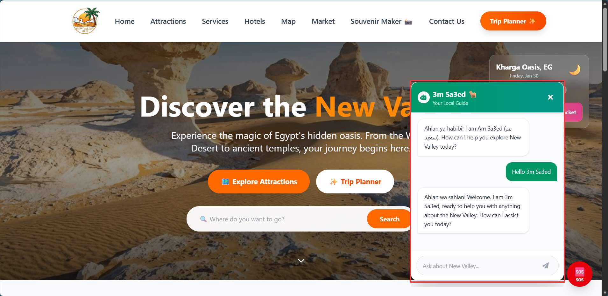
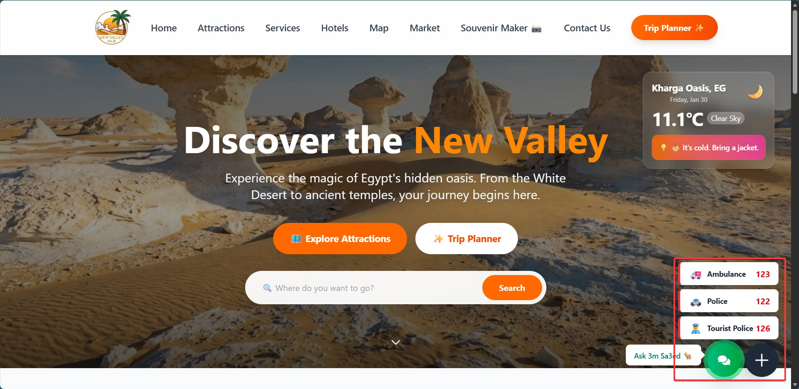

# New Valley Hub (بوابة الوادي الجديد) 🌴
> **"Discover the Magic of Egypt's Hidden Oasis - Digital Tourism Platform."**


---

## 📖 About the Project

**New Valley Hub** is a comprehensive full-stack digital tourism platform dedicated to the New Valley Governorate (Al-Wadi Al-Gadid) in Egypt. Whether exploring the surreal landscapes of the White Desert or the historic oasis towns of Kharga and Dakhla, this platform connects travelers with the rich heritage and hidden gems of the region. Built with modern web technologies, it bridges the gap between digital convenience and authentic local experiences.

---

## 🔥 Key Features

### 🤖 AI Chatbot - "3m Sa3ed" (عم سعيد)
**Your Virtual Local Guide.** An intelligent chatbot powered by Google Gemini AI that provides instant assistance.
* **24/7 Availability:** Get answers about attractions, hotels, and services anytime.
* **RAG-Enhanced:** Uses Retrieval Augmented Generation to search the local database for accurate, context-aware responses.
* **Friendly & Engaging:** Features a modern floating button with pulse animations and call-to-action label.
* **Bilingual Support:** Responds in friendly English with Egyptian Arabic expressions.

### ✨ AI-Powered Trip Planner
**The heart of the experience.** A smart tool that helps users plan their perfect journey.
* **Personalized Itineraries:** Generates travel plans based on user preferences.
* **Smart Recommendations:** Suggests best times to visit and routes.

### 🗺️ Interactive Map & Attractions
* **Visual Exploration:** Explore landmarks, oases, and hidden spots on a dynamic, interactive map.
* **Curated Listings:** A rich database of historical sites and natural wonders like the White Desert.

### 🛍️ Local Marketplace (Souq)
* **Authentic Crafts:** A digital market for local artisans to showcase pottery, carpets, and dates.
* **Support Locals:** Direct connection between tourists and local producers.

### 🏨 Hotels & Accommodation
* **Stay Finder:** Browse and filter hotels, eco-lodges, and desert camps.
* **Booking Details:** Detailed information and amenities for every stay.

### 🛠️ Services & Utilities
* **Travel Essentials:** Find nearby restaurants, transportation hubs, hospitals, and banks.
* **Emergency Info:** Quick access to police and ambulance contacts.

### 📸 Digital Souvenir Maker
A unique, interactive feature allowing travelers to create their own digital memories.
* **Custom Canvas Tool:** Users can upload photos or select from high-quality local backgrounds.
* **Personalization:** Add custom text with stylized calligraphy fonts.

### 🏛️ Official Leadership Section
* **Governor's Message:** A dedicated section featuring the Governor's vision and biography.
* **CMS Controlled:** Fully editable content via the custom Django Admin panel.

### 👥 Meet the Team
* **Smart Connect:** Automatically displays team members' social links (GitHub/LinkedIn).
* **Credits:** Showcasing the developers and creators behind the platform.

---

## 🛠️ Tech Stack

| Domain | Technologies |
| :--- | :--- |
| **Frontend** | React.js, Tailwind CSS, Axios, Framer Motion |
| **Backend** | Django Rest Framework (DRF), Python |
| **Database** | SQLite (Dev) / PostgreSQL (Prod) |
| **Tools** | Vite, Postman, Git |

---

## 📸 Screenshots

| Home Page | Trip Planner ✨ |
| :---: | :---: |
|  |  |

| Interactive Map | Attractions |
| :---: | :---: |
|  |  |

| Hotels | Local Market 🛍️ |
| :---: | :---: |
|  |  |

| Services | Souvenir Maker |
| :---: | :---: |
|  |  |

| Governor's Section | Team Section |
| :---: | :---: |
|  |  |

| AI Chatbot - 3m Sa3ed 🤖 | Chatbot Interface |
| :---: | :---: |
|  |  |

---

## 🚀 Getting Started

1.  **Clone the repository**
    ```bash
    git clone [https://github.com/yourusername/new-valley-hub.git](https://github.com/yourusername/new-valley-hub.git)
    ```

2.  **Run Backend**
    ```bash
    cd backend
    pip install -r requirements.txt
    python manage.py runserver
    ```

3.  **Run Frontend**
    ```bash
    cd frontend
    npm install
    npm run dev
    ```

---

Made with ❤️ for **New Valley** 🇪🇬
